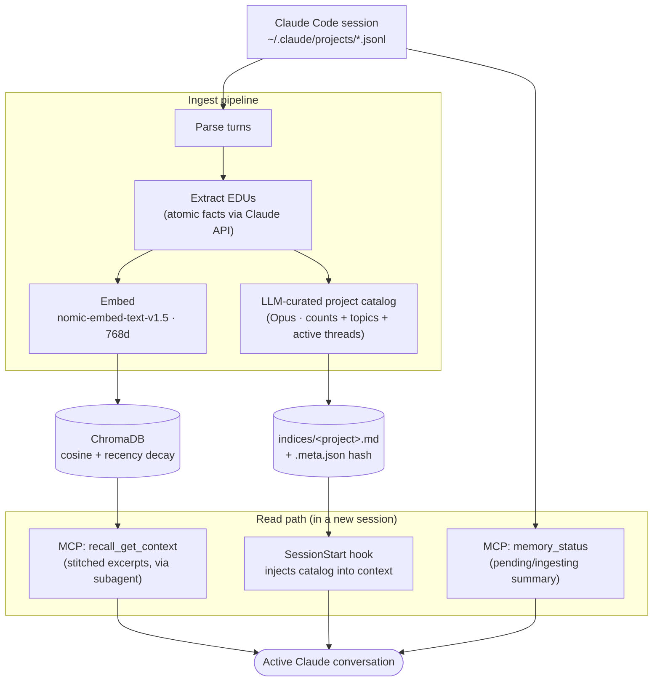

# claude-memory

> 📖 [The Building Blocks of an Agent Memory System](https://proximal.hashnode.dev/the-building-blocks-of-an-agent-memory-system) — how this system is designed and how it works under the hood.

Local conversation memory for Claude Code. Parses JSONL session files, extracts atomic facts (EDUs) via the Claude API, embeds them in ChromaDB, and exposes semantic search through an MCP server.

## How it works



1. **Parse** — reads Claude Code session files from `~/.claude/projects/`
2. **Extract** — sends conversation turns to the Claude API (via `claude` CLI) which decomposes them into Elementary Discourse Units (EDUs) — self-contained atomic facts
3. **Embed** — encodes EDUs with `nomic-ai/nomic-embed-text-v1.5` (768d) and stores them in ChromaDB with cosine similarity
4. **Search** — recency-weighted retrieval: `score = similarity * e^(-0.007 * days_ago)`

Resumed sessions are handled incrementally — existing EDUs are loaded as context, and only new turns are processed.

## What it adds to Claude Code

Installing the plugin registers three MCP tools and two hooks. All run locally; no data leaves your machine except the EDU-extraction calls to the Claude API.

### MCP tools

| Tool | What it does | When to use |
|---|---|---|
| `memory_status` | Reports the size of the processed store, time since the last session activity, and a per-session table of conversations not yet ingested (`new`, `updated`, or `ingesting`). | Sanity check at the start of a new conversation. The plugin also calls it for you on `UserPromptSubmit`. |
| `ingest_sessions` | Processes new or changed Claude Code conversations into searchable memory. Runs the full parse → extract → embed → label pipeline. | When `memory_status` reports unprocessed conversations and you want them searchable. |
| `recall_get_context` | Searches past Claude Code conversations across all projects and returns a wall of stitched trajectory excerpts matching the query. | When you need the actual content of a past decision/discussion, not just a one-line summary. **Always dispatch via an `Agent`/`Task` subagent** — the wall can be 50-400KB. |

### Hooks (registered automatically)

| Hook | Fires on | What it does |
|---|---|---|
| `SessionStart` (default) | Every new conversation | (1) Bootstraps the plugin's `.venv` if missing. (2) Resets the once-per-session prompted-flag. (3) Injects the per-project memory **catalog** (project overview + preferences + available-memory counts + active threads + recent activity + keyword cloud) into Claude's context, titled `# Conversation memory index — project <name>`. The catalog advertises what's available; full content is fetched on demand via `recall_get_context`. |
| `SessionStart` (matcher: `clear`) | `/clear` | Kicks off a fire-and-forget `claude-memory ingest` of all pending sessions, *excluding* the new post-clear session whose ID is in the SessionStart payload. |
| `UserPromptSubmit` | First user prompt of a session | Calls `memory_status` once, then injects an `additionalContext` directive telling Claude to either silently call `ingest_sessions` (≤5 pending) or surface the count and ask before ingesting (>5 pending). |

## Install

```bash
claude plugin marketplace add DuaneNielsen/claude-memory
claude plugin install claude-memory@duane-claude-plugins
```

The plugin auto-creates a `.venv` and installs dependencies on first session start via `uv sync`. The MCP server and hooks are registered automatically.

To allow the plugin's MCP tools to run without permission prompts, add these to your `~/.claude/settings.json` allow list:

```json
{
  "permissions": {
    "allow": [
      "mcp__plugin_claude-memory_claude-memory__ingest_sessions",
      "mcp__plugin_claude-memory_claude-memory__recall_get_context",
      "mcp__plugin_claude-memory_claude-memory__memory_status"
    ]
  }
}
```

Requires `claude` CLI to be installed and authenticated (Claude Code). EDU extraction uses the Claude API via the CLI — no local LLM needed.

## CLI

```bash
# Ingest all new/changed sessions
claude-memory ingest

# Re-ingest everything from scratch
claude-memory ingest --force

# Use a specific model (default: sonnet)
claude-memory ingest --model opus

# Tune concurrency
claude-memory ingest --concurrency 4

# Search memories
claude-memory search "pipewire filter chain config"
claude-memory search "auth middleware" --project primesignal

# Show stats
claude-memory stats

# List sessions with turn/word/EDU counts
claude-memory sessions
claude-memory sessions --sort edus
claude-memory sessions --project home

# Dump all EDUs
claude-memory dump
claude-memory dump --json --project frigate

# Reset ingestion state
claude-memory reset --session abc123    # prefix match
claude-memory reset --project home
claude-memory reset --partial           # reset all incrementally-ingested sessions
claude-memory reset --all
claude-memory reset --all --state-only  # keep EDUs, clear state (forces re-check)

# Run MCP server (stdio)
claude-memory serve
```

## References

The EDU extraction approach is based on **EMem** ("A Simple Yet Strong Baseline for Long-Term Conversational Memory", [arXiv:2511.17208](https://arxiv.org/abs/2511.17208)), which decomposes conversations into atomic Elementary Discourse Units and retrieves them via dense similarity with recency weighting — achieving 0.780 on LoCoMo using only 738 tokens of context vs 23,653 for full-context baselines.

## Data storage

- ChromaDB: `~/.local/share/claude-memory/chromadb/`
- Ingestion state: `~/.local/share/claude-memory/ingested_sessions.json`

## Session retention

Claude Code deletes sessions older than 30 days by default. To keep history longer, add to `~/.claude/settings.json`:

```json
{
  "cleanupPeriodDays": 3650
}
```
